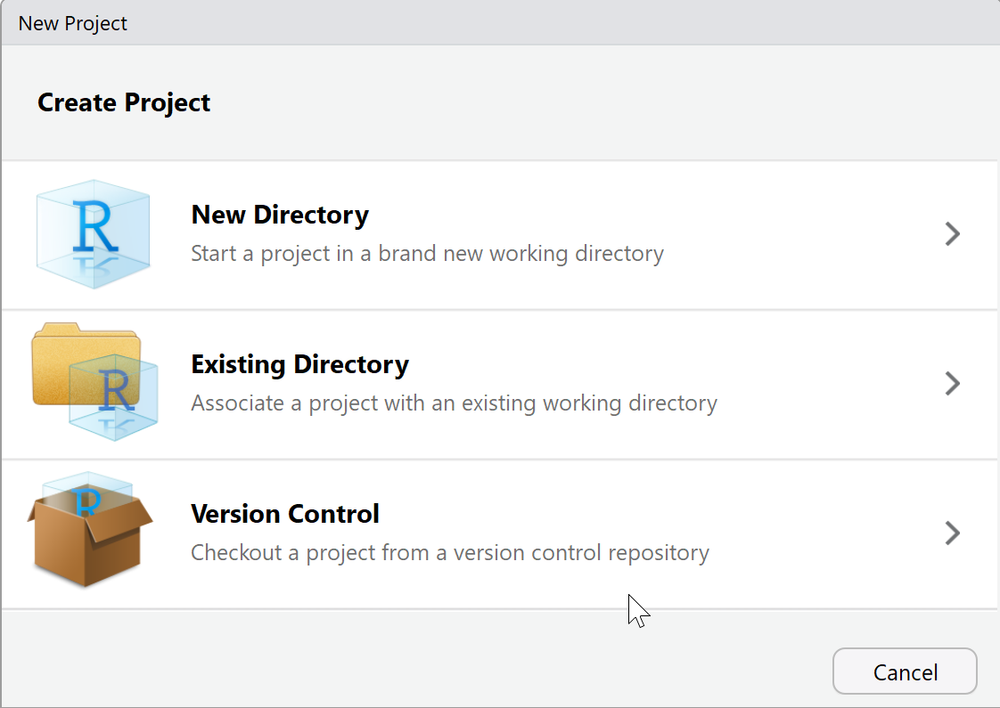
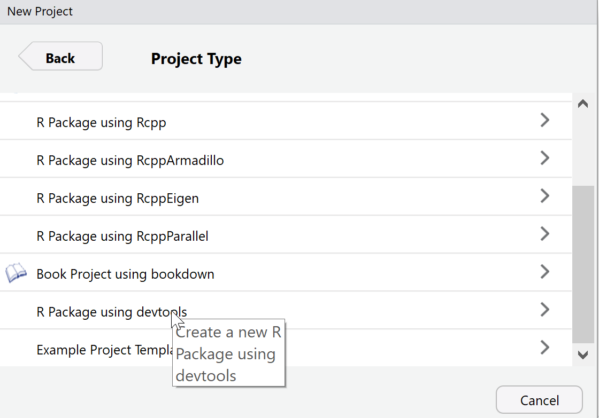
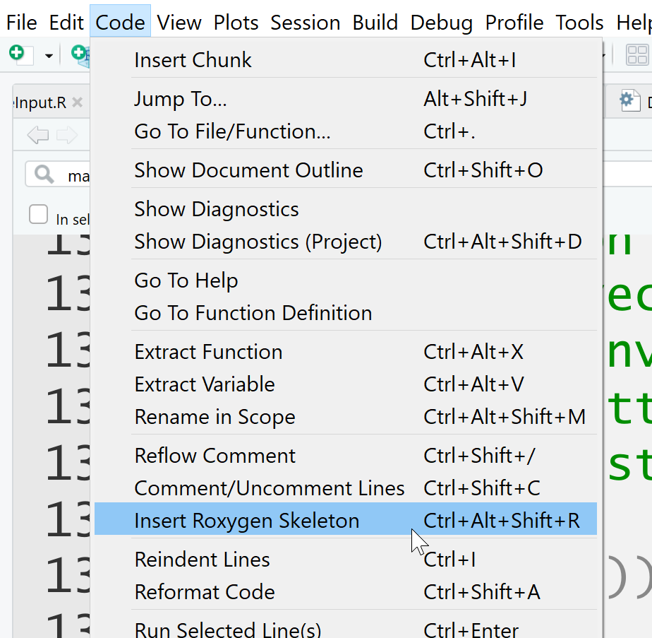
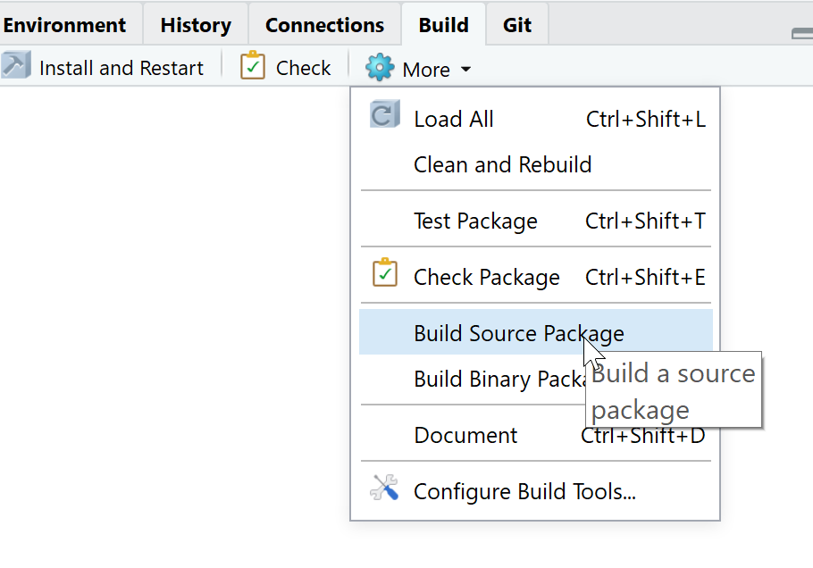

```{r setup, include=FALSE}
knitr::opts_chunk$set(echo = TRUE)
```

******
# 3 sources précieuses:

*  [Writing R Extensions](https://cran.r-project.org/doc/manuals/r-release/R-exts.html)  
*  [Hadley Wickham, 2015, R packages, O’Reilly](http://r-pkgs.had.co.nz/)  
*  [Roger D. Peng, Sean Kross, and Brooke Anderson, 2017, Mastering Software Development in R](https://bookdown.org/rdpeng/RProgDA/)  

#	Utilité des packages sur R

**Etendre les fonctionnalités de R et simplifier l’utilisation du code**

  *   Plus besoin de connaître les détails du code.     
  *   Connaître uniquement les arguments à entrer et les résultats en sortie.   


**Regrouper les familles de fonctions**

  *   Regrouper dans des collections de fonctions.  
  *   Ensemble de fonctions assemblés dans un package R.    

***

**Partager**

  *   Meilleur moyen de distribuer du code à d’autres utilisateurs.   
  *   Les packages R sont écrits dans un format normalisé.    
  *   Les utilisateurs de R déjà familiarisés avec install.packages() ou install_github().


**Tester le code**

  * Multiples outils fournis avec R (et RStudio) de tests des packages. 


#	Un exemple de package

***

##	Cartography de Timothé Giraud

Un exemple que j'aime bien :  
https://github.com/riatelab/cartography 
parce que :  
1.  Je sais ce qu'il fait  
2.  Il est bien structuré  

***

##	Compréhension de la structures de base d’un package

Début de vie du package R sur votre ordinateur: **un répertoire ou un projet**.   

2 sous-répertoires minimum:  

*  **R**, qui contient tous vos fichiers de code R  
*  **man**, qui contient vos fichiers de documentation.

2 fichiers au minimum:  

*  **DESCRIPTION**: Métadonnées (Nom, version de R, auteur,..)
*  **NAMESPACE**: Noms des fonctions exportées, noms des packages et fonctions à importer pour construire les fonctions. 

2 packages facilitent la création de nouveaux packages:

* **devtools**  
* **roxygen2** 

***

###	Descriptions

Le fichier DESCRIPTION est une partie essentielle d'un package R car il contient des métadonnées clés pour le package utilisées par les repertoires tels que CRAN et par R. En particulier, ce fichier contient le **nom du package**, **le numéro de version**, les informations de contact de **l'auteur**, les informations de **la licence**, ainsi que toutes **les dépendances à d'autres packages**.

À titre d’exemple, voici le fichier DESCRIPTION du packageage mvtsplot sur CRAN. Ce package fournit une fonction permettant de tracer des données de séries temporelles multivariées.

```
Package:  mvtsplot
Version:  1.0-3
Date:  2016-05-13
Depends:  R (>= 3.0.0)
Imports: splines, graphics, grDevices, stats, RColorBrewer
Title:  Multivariate Time Series Plot
Author:  Roger D. Peng <rpeng@jhsph.edu>
Maintainer:  Roger D. Peng <rpeng@jhsph.edu>
Description:  A function for plotting multivariate time series data.
License:  GPL (>= 2)
URL: https://github.com/rdpeng/mvtsplot
```

***

###	NAMESPACE

Le fichier NAMESPACE spécifie l'interface du package présenté à l'utilisateur. Cela se fait via une série d'instructions export(), qui indiquent quelles fonctions du package sont exportées vers l'utilisateur. Les fonctions non exportées ne peuvent pas être appelées directement par l'utilisateur. Outre les exportations, le fichier NAMESPACE spécifie également les fonctions ou packages importés par le package. Si votre package dépend de fonctions d'un autre package, vous devez les importer via le fichier NAMESPACE.

Vous trouverez ci-dessous le fichier NAMESPACE du packageage mvtsplot décrit ci-dessus.

```
export("mvtsplot")

import(splines)
import(RColorBrewer)
importFrom("grDevices", "colorRampPalette", "gray")
importFrom("graphics", "abline", "axis", "box", "image", "layout",
           "lines", "par", "plot", "points", "segments", "strwidth",
           "text", "Axis")
importFrom("stats", "complete.cases", "lm", "na.exclude", "predict",
           "quantile")

```
***

Nous pouvons voir ici qu’une seule fonction est exportée du package (la fonction mvtsplot()). Il existe deux types d'instructions d'importation:  

*  **import()**, prend simplement un nom de package comme argument, et l'interprétation est que toutes les fonctions exportées depuis ce package externe seront accessibles à votre package
*  **importFrom()**, prend comme argument un package et une série de noms de fonctions. Cette directive vous permet de spécifier exactement la fonction dont vous avez besoin depuis un package externe. Par exemple, ce package importe les fonctions colorRampPalette() et gray() du package grDevices.

De manière générale, il est préférable d’utiliser importFrom() et de spécifier la fonction dont vous avez besoin à partir d’un package externe. 

***

En ce qui concerne l'exportation de fonctions, il est important de **bien réfléchir aux fonctions que vous souhaitez exporter**. 

Les fonctions exportées doivent être **documentées**. 

Les utilisateurs s'attendent généralement à ce que les fonctions exportées soient **présentes dans les itérations suivantes du package**. Il est généralement préférable de **limiter le nombre de fonctions** que vous exportez. 

**Eviter de supprimer une fonction exportée** une fois que les utilisateurs sont habitués à l’avoir disponible peut perturber les utilisateurs. 

**Eviter d'esporter une longue liste de fonctions**:  Noms de fonctions pouvant entrer en conflit avec des fonctions d’autres packages.  

***

####	Appel des fonctions externes au package

Lorsque vous commencez à utiliser plusieurs packages dans R, la probabilité que deux fonctions aient le même nom augmente. Par exemple, le package dplyr couramment utilisé a une fonction nommée filter(), qui est également le nom d’une fonction du package stats. Si on a les deux packages chargés (un scénario plus que probable), comment sait-on exactement quelle fonction filter() ils faut appeler?

Dans R, chaque fonction a un nom complet, qui inclut le nom du package dans le nom:

```
<package name>::<exported function name>

```

Par exemple, la fonction filter() du package dplyr peut être appelée sous la forme dplyr::filter(). De cette façon, il n’ya aucune confusion sur la fonction filter() que nous appelons. Bien qu'en principe, chaque fonction puisse être appelée de cette manière, cela peut être fastidieux pour un travail interactif. Cependant, pour la programmation, il est souvent plus sûr d'appeler une fonction en utilisant le nom complet.

***

###	R

Le sous-répertoire R contient tout votre code R, soit dans un seul fichier, soit dans plusieurs fichiers. Pour les packages plus volumineux, il est généralement préférable de scinder le code en plusieurs fichiers regroupant logiquement les fonctions. Les noms des fichiers de code R n’importe pas, mais il n’est généralement pas judicieux d’avoir des espaces dans les noms de fichiers.

***

###	man

Le sous-répertoire man contient les fichiers de documentation de tous les objets exportés d'un package. Avec les anciennes versions de R, il fallait écrire la documentation des objets R directement dans le répertoire man en utilisant une notation de type LaTeX. Cependant, avec le développement du package roxygen2, nous n’avons plus besoin de le faire et nous pouvons écrire la documentation directement dans les fichiers de code R. Par conséquent, vous aurez probablement peu d'interaction avec le répertoire man, car tous les fichiers qu'il contient seront automatiquement générés par le packageage roxygen2. 

***
##	Votre premier package en quelques minutes

***

**Étape 1 : Création du projet Rstudio**

Grâce à Rstudio et des packages tels que {devtools}, {usethis} et {roxygen2}, concevoir un package revient à cliquer sur File > New Project > New Directory > R package using devtools.

Assurez-vous d’avoir bien installé les packages suivants :

```{r eval=F}
install.packages(c("devtools", "usethis", "roxygen2"))
```





```{r eval=F}
available::available("monpackage")
```


RStudio s’ouvre alors sur un nouveau projet avec un nouveau dossier contenant une arborescence dont il suffit de retenir deux choses :

*  le fichier DESCRIPTION qu’il faut remplir à la main en remplacant les valeurs pré-remplies (nom, licence, etc)
*  le dossier R dans lequel il faudra placer ses fonctions

***

**Étape 2 : le fichier DESCRIPTION**

Ouvrir le fichier et l’éditer.
Vous pouvez voir ce fichier comme un texte à trou dans lequel il faut entrer votre nom, prénom, décrire ce que fait le package, etc. Vous devez choisir une licence (GPL-3, MIT).

Une fois ce fichier complété, cliquez sur check dans l’onglet build en haut à droite dans Rstudio.


Une cinquantaine de tests seront alors réalisés. Dans la mesure où votre package est vide, il est essentiel d’avoir 0 erreur, 0 warning et 0 note.

***

**Étape 3 : Création de fonctions**

Vous pouvez maintenant commencer à ranger vos fonctions dans le dossier R de l’arborescence, dans des fichiers portant l’extension .R.

```{r}
moyenne <- function(x){
  x <- x %>% na.omit()
  sum(x)/length(x)
}
```

***

**Étape 4 : Documentation et NAMESPACE**

En cliquant sur check à l’étape 2, vous avez fabriqué un dossier man dans l’arborescence. Mais pour l’instant il est vide…


Le fichier NAMESPACE comme le dossier man ne seront pas le centre de notre attention. Le NAMESPACE sert à définir comment notre package interagit avec le monde extérieur (importer d’autres fonctions, d’autres packages, exporter telle ou telle fonction) et le dossier man contient la documentation des fonctions. En pratique ils seront générés et mis à jour automatiquement grâce à {roxygen2}, en cliquant sur le bouton check.

Afin que le NAMESPACE et man soient gérés automatiquement, nous allons adopter un système de balises spécifiques pour documenter le code R. Des commentaires un peu particuliers vont commencer, non pas par #, mais par #'

```{r eval=FALSE}
#' moyenne d’un vecteur
#' Une fonction pour faire une moyenne en enlevant les valeurs manquantes
#'
#' @param x un vecteur numerique
#'
#' @return la fonction renvoie la moyenne d'un vecteur
#' @import magrittr
#' @importFrom stats na.omit
#' moyenne(c(4,5))
#' @export
moyenne <- function(x){
  x <- x %>% na.omit()
  sum(x)/length(x)
}
```

Vous pouvez génèrer directement un template de documentation. On peut ainsi aller dans Code > Insert Roxygen Skeleton :



La fonction moyenne ici en exemple utilise le %>%, il faut donc lier notre package au package {magrittr} qui contient cet opérateur. De même la façon na.omit vient du package {stats}. Notre package dépend donc de {magrittr} et de {stats}. Un utilisateur qui ne disposerait pas de {magrittr} ou {stats} ne pourrait pas utiliser notre fonction !

C’est @importFrom qui permet d’aller chercher dans le package {stats} la fonction na.omit utilisée, et @import va importer l’intégralité des fonctions de {magrittr}.

@import importe TOUT le package tandis que @importFrom permet de n’importer qu’un ensemble de fonctions. C’est @importFrom qui sera privilégié car c’est le niveau le plus fin.

MAIS cela ne suffit pas. Il faut aussi modifier le fichier DESCRIPTION pour y ajouter la dépendance aux deux packages {magrittr} et {stats} dans la rubrique Imports. En l’état, un check renverra des warnings/erreurs. (vous pouvez tester !)

Cependant, modifier le fichier DESCRIPTION à la main est source d'erreurs. Un simple espace au mauvais endroit peut générer des erreurs. Nous allons donc privilégier l’usage de {devtools}.

```{r eval=FALSE}
devtools::use_package("stats")
devtools::use_package("magrittr")
```

Le fichier DESCRIPTION ressemble maintenant à ceci :

```
Package: monpackage
Title: une demonstration
Version: 0.0.0.9000
Authors@R: person("Arnaud", "Milet", email = "arnaud.milet@f-sidd.com", role = c("aut", "cre"))
Description: il s agt d un test de demonstration.
Depends: R (>= 3.5.1)
License: GPL-3
Encoding: UTF-8
LazyData: true
RoxygenNote: 6.1.0
Imports: stats,
    magrittr

```


Le package est créé! Faites un check puis cliquez dans l’onglet build sur Install and Restart. R redémarre et lance votre package (on notera le library(monpackage) lancé pour nous dans la console). La fonction moyenne est utilisable et taper ?moyenne revient à interroger R sur l’aide de la fonction : une page de documentation du plus bel effet est ouverte dans l’onglet help.

*** 

**Étape 5 : Partager son travail**
Dans l’onglet Build se trouve un bouton more qui vous permet de construire votre package source (Build Source Package).



Cela génère un fichier compressé en tar.gz (ici monpackage_0.0.0.9000.tar.gz) que vous pouvez partager avec qui veut… voire l’envoyer au CRAN pour le rendre disponible à la communauté.


##	Exercice: Créer un package affichant votre nom en console


#	Package devtools 

devtools est maintenu par Hadley Wickham et facilite la création de package.

***

Fonctions clés incluses dans devtools, dans l'ordre dans lequel vous les utiliserez probablement lorsque vous développez un package R:

```{r echo=FALSE}
Fonctions_Devtools<-data.frame(Fonction =c("load_all",
            "document",
            "use_data",
            "use_vignette",
            "use_readme_rmd",
            "use_build_ignore",
            "check",
            "build_win",
            "use_travis",
            "use_cran_comments",
            "submit_cran",
            "use_news_md"),
Usage=c("Charge le code de toutes les fonctions du package.",
        "Créer d'une part le répertoire \\man et ses fichiers de documentation sur les fonctions et d'autre part le fichier «NAMESPACE» à partir des codes roxygen2 repérés",
        "Enregistrer un objet contenu dans votre session R en tant que données appartenant au package",
        "Configure le package pour inclure une vignette",
        "Configure le package pour inclure un fichier README au format Rmarkdown",
        "Spécifiez ici les fichiers à ignorer lors de la création du package R (par exemple, si vous avez un dossier dans lequel vous rédigez un article de journal sur le package, vous pouvez inclure tous les fichiers associés dans un dossier que vous avez défini comme étant ignoré pendant le processus de la construction du package)",
        "Vérifiez dans le package R s'il existe d'éventuels avertissements : ERROR, WARNING ou NOTE",
        "Construisez une version du package pour Windows et envoyez-la à vérifier sur un ordinateur Windows. Vous recevrez un email avec un lien vers les résultats.",
        "Configure le package pour faciliter l'utilisation de Travis CI avec le package",
        "Créez un fichier dans lequel vous pouvez ajouter des commentaires à inclure lors de votre soumission CRAN.",
        "Soumettre le package à CRAN",
        "Ajouter un fichier au package pour indiquer les changements dans les nouvelles versions")
)
knitr::kable(Fonctions_Devtools)
```


Certaines de ces **fonctions ne devront être utilisées qu’une fois pour un package**. Les fonctions uniques (par package) sont principalement **celles qui configurent un certain type d’infrastructure pour le package**. Par exemple, si vous souhaitez utiliser **R Markdown pour créer un fichier README** pour un package que vous publiez sur GitHub, vous pouvez créer l'infrastructure appropriée à l'aide de la fonction **use_readme_rmd**. Cette fonction ajoute un fichier  README dans le répertoire principal du package avec le nom «README.Rmd». Vous pouvez éditer ce fichier et le convertir en Markdown pour fournir aux utilisateurs de GitHub plus d'informations sur votre package. Toutefois, vos vérifications CRAN poseront des problèmes s’il existe un fichier README dans ce répertoire de niveau supérieur du package. Par conséquent, la fonction **use_readme_rmd ajoute** également les noms de fichier du fichier **README** R Markdown, ainsi que le fichier Markdown créé, dans le fichier **“.Rbuildignore”**, donc il n’est pas inclus lors de la construction du package.


#	Documentation

Il existe deux principaux types de documentation que vous pouvez inclure avec les packages:

*  Des documents plus longs : README et Vignettes    
*  Fichiers d'aide plus courts: générés automaytiquement grâce aux tags du package roxygen2  


***

##	Vignette et README

Vous voudrez probablement créer **un document qui explique aux utilisateurs comment utiliser votre package**. Vous pouvez le faire à travers deux formats:

*   **Vignette**: Fourni avec votre package R, il est disponible quand on installe votre package depuis CRAN. Ils sera également disponible après une installation depuis github à condition d'utiliser build_vignettes = TRUE lors de l'exécution de install_github.

*  **Fichier README**: Si votre package est sur GitHub, ce document sera affiché sur la page principale du repertoire.

***

### README

Un package n'a besoin d'un fichier README que si vous postez le package **sur GitHub**. Pour tout repertoire GitHub, s'il existe un fichier README.md dans le répertoire supérieur du repertoire, il sera **visible sur la page principale du repertoire GitHub** sous le contenu du repertoire répertorié. Pour un exemple, visitez https://github.com/riatelab/cartography et faites défiler vers le bas. Vous verrez une liste de tous les fichiers et sous-répertoires inclus dans le repertoire du package, ainsi que le contenu du fichier README.md du package, qui fournit un didacticiel sur l’utilisation du package.

Si le fichier README n'a pas besoin d'inclure le code R, vous pouvez l'écrire directement sous forme de fichier **.md**, à l'aide de la syntaxe Markdown. Si vous souhaitez inclure du code R, vous devez commencer par un fichier **README.Rmd**, que vous pouvez **convertir en Markdown à l'aide de knitr**. Vous pouvez utiliser le package devtools pour ajouter un fichier README.md ou README.Rmd à un répertoire de package, en utilisant respectivement **use_readme_md** ou **use_readme_rmd**. Ces fonctions ajouteront le fichier approprié au niveau supérieur du répertoire du package et ajouteront également le nom du fichier à **«.Rbuildignore»**, car la présence de l’un de ces fichiers au niveau supérieur du répertoire du package risquerait sinon de poser problème lors de la création du package.

Le fichier **README est utile pour fournir aux utilisateurs de GitHub des informations sur votre package**, mais il ne sera **pas inclus dans les versions du package ou ne sera pas disponible via CRAN** pour les packages qui y sont postés. Si vous souhaitez créer des aides diponibles sur le CRAN, **vous devez le faire en ajoutant une ou plusieurs vignettes de package**. Les vignettes sont stockées dans un sous-répertoire de vignettes dans le répertoire du package.

***
### Vignette 

Pour ajouter un fichier de vignette, enregistré dans ce sous-répertoire (qui sera créé si vous ne l'avez pas déjà), utilisez la fonction **use_vignette** de devtools. Cette fonction prend comme argument le nom de fichier de la vignette que vous souhaitez créer et le package pour lequel vous souhaitez le créer (la valeur par défaut est le package dans le répertoire de travail en cours). Par exemple, si vous travaillez actuellement dans le répertoire de niveau supérieur de votre package et que vous souhaitez ajouter une vignette appelée "model_details", vous pouvez le faire avec le code:

```{r, eval=F}
use_vignette("model_details")
```

Vous pouvez avoir **plus d'une vignette par package**, ce qui peut être utile si vous souhaitez inclure une vignette donnant **un aperçu plus général du package**, ainsi que quelques **vignettes plus détaillées** sur des aspects ou des applications particuliers.

Une fois que vous avez créé une vignette avec use_vignette, veillez à mettre à jour l’entrée d’indexation de la vignette dans le **YAML de la vignette** (le code situé en haut du document R Markdown). Remplacez «Titre de la vignette» par le titre que vous utilisez pour la vignette.

***

##	Rmarkdown et Knitr

Les fichiers vignette et README peuvent être écrits en tant que **fichiers RMarkdown, ce qui vous permettra d’inclure des exemples de code R** et des résultats de votre package. L'un des outils les plus intéressants de R est le système **knitr** qui combine code et texte pour créer un document reproductible.

Les fichiers RMarkdown sont principalement écrits à l'aide de Markdown. Pour écrire des fichiers RMarkdown, vous devez comprendre ce que sont les **langages de marquage comme Markdown** et leur fonctionnement. Ou pas... Dans Word et les autres programmes de traitement de texte que vous avez utilisés, vous pouvez ajouter une mise en forme à l’aide de boutons et de raccourcis clavier (par exemple, «Ctrl-B» pour indiquer en gras). Le fichier enregistre les mots que vous tapez. Il enregistre également la mise en forme, mais vous voyez la sortie finale, plutôt que le balisage de mise en forme, lorsque vous modifiez le fichier (**WYSIWYG - What You See is What You Get**). En revanche, dans les langages de marquage, vous marquez directement le document pour indiquer le formatage de la version finale (par exemple, vous tapez `**` **bold** `**` dans le fichier pour obtenir un document en gras). Voici des **exemples de langages de balisage:**

*  HTML
*  Latex
*  Markdown

***

Pour écrire un fichier en Markdown, vous devez connaître les conventions de création du formatage. Vous pouvez consulter le guide du RMarkdown ou plus simplement la cheatsheet RMarkdown.


[R Markdown: The Definitive Guide](https://bookdown.org/yihui/rmarkdown/)
[R Markdown CheatSheet](https://www.rstudio.com/resources/cheatsheets/#rmarkdown)
***

Le début d'un fichier Markdown fournit des métadonnées pour le fichier (auteurs, titre, format) dans un langage appelé YAML. Par exemple, la section YAML d'une vignette de package pourrait ressembler à ceci:  

```
---
title: "Model Details for example_package"
author: "Jane Doe"
date: "2016-11-08"
output: rmarkdown::html_vignette
vignette: >
  %\VignetteIndexEntry{Model Details for example_package}
  %\VignetteEngine{knitr::rmarkdown}
  %\VignetteEncoding{UTF-8}
---
```

Lors de la création de documents R Markdown à l'aide de la barre d'outils RStudio, une grande partie de ce YAML sera automatiquement générée en fonction de vos spécifications lors de l'ouverture du fichier initial. Cependant, ce n’est pas le cas des vignettes de packages, pour lesquelles vous devrez aller dans le YAML et ajouter les auteurs et le titre vous-même. Conservez par défaut le moteur de vignette, l'encodage, la sortie et la date de la vignette.

***

Les fichiers R Markdown fonctionnent  comme les fichiers Markdown, mais ajoutent la possibilité d'inclure du code R qui sera exécuté avant le rendu du document final. La sortie finale aura les résultats de votre code et du texte normal.

Les étapes de base pour ouvrir et restituer un fichier R Markdown dans RStudio sont les suivantes:  

1.  Pour ouvrir un nouveau fichier R Markdown, allez dans "File" -> "New file" -> "RMarkdown ..." -> pour l'instant, choisissez un "Document" au format "HTML".  
2. Cela ouvrira un nouveau fichier R Markdown dans RStudio. L'extension de fichier pour les fichiers R Markdown est «.Rmd».  
3.  Le nouveau fichier est livré avec un exemple de code et de texte. Vous pouvez exécuter le fichier tel quel pour essayer l'exemple. Vous allez finalement supprimer cet exemple de code et de texte et le remplacer par le vôtre.  
4.  Une fois que vous avez «tricoté» le fichier R Markdown, R rendra un fichier HTML avec la sortie. Ceci est automatiquement enregistré dans le même répertoire que celui dans lequel vous avez enregistré votre fichier .Rmd.  
5.  Ecrivez tout sauf le code R en utilisant la syntaxe Markdown.

***

La fonction knit du package knitr fonctionne en prenant un document au format R Markdown (parmi quelques formats possibles), en le lisant pour tous les marqueurs du début du code R, en exécutant n’importe quel code entre ce marqueur «début» et un marqueur. marqueur indiquant un retour à Markdown normal, écrivant les résultats pertinents du code R dans le fichier Markdown au format Markdown, puis transmettant l'intégralité du document, maintenant au format Markdown au lieu du format R Markdown, à un logiciel capable de restituer Markdown au format de sortie souhaité (par exemple, compiler un document PDF, Word ou HTML).

Cela signifie que tout ce qu'un utilisateur doit faire **pour inclure du code R, qui sera exécuté si nécessaire, dans un document consiste à le séparer correctement des autres parties du document au moyen des marqueurs appropriés**. Pour indiquer le code R dans un document RMarkdown, vous devez séparer le bloc de code à l'aide de la syntaxe suivante:

` ```{r} `  
`my_vec <- 1:10`    
` ```  `  

Cette syntaxe indique à R comment trouver le début et la fin des éléments de code R lorsque le fichier est rendu. R passera en revue, trouvera chaque chunk de code R, l'exécutera et créera une sortie (sortie imprimée ou chiffres, par exemple), puis passera le fichier à un autre programme pour terminer le rendu (par exemple, Tex pour les fichiers pdf).

***

Vous pouvez spécifier un **nom pour chaque chunk**, si vous le souhaitez, en l’insérant après «r» lorsque vous commencez votre chunk. Par exemple, pour attribuer le nom load_mtcars à un fragment de code qui charge le jeu de données mtcars, spécifiez ce nom au début du fragment de code:

` ```{r load_mtcars} `  
` data(mtcars)`  
` ```  `  

Voici quelques conseils pour nommer des fragments de code:  

*  Les noms de chunks doivent être uniques dans un document.  
*  Tous les chunks que vous ne nommez pas sont numérotés par knitr.  

Vous n'êtes pas obligé de nommer chaque chunk. Cependant, il y a quelques avantages:  

*  Il sera plus facile de trouver des erreurs.  
*  Vous pouvez utiliser les étiquettes de bloc pour référencer des étiquettes de figure.  
*  Vous pouvez référencer des chunk plus tard par nom.  

***

### Quelques options knitr

Vous pouvez également ajouter des options lorsque vous démarrez un chunk. Beaucoup de ces options peuvent être définies comme VRAI / FAUX.

Pour inclure l'une de ces options, ajoutez l'option et la valeur dans les parenthèses d'ouverture, puis séparez les multiples options par des virgules:

`  ```{r  messages = FALSE, echo = FALSE}`   
`  mtcars[1, 1:3]`   
` ```  `  
***

Vous pouvez définir des options «globales» au début du document. Cela créera de nouvelles valeurs par défaut pour tous les chunks du document. Par exemple, si vous souhaitez que écho, avertissement et message soient FAUX par défaut dans tous les fragments de code, vous pouvez exécuter:

` ```{r  global_options}`   
` knitr::opts_chunk$set(echo = FALSE, message = FALSE, warning = FALSE)`   
` ```  `  

Si vous définissez à la fois les options de bloc globales et locales que vous avez définies spécifiquement pour un bloc, celles-ci auront priorité. Par exemple, exécuter un document avec:

`  ```{r  global_options}`   
`  knitr::opts_chunk$set(echo = FALSE, message = FALSE, warning = FALSE)`  
` ```  `  

` ```{r  check_mtcars, echo = TRUE}`   
` head(mtcars, 1)`   
` ```  `  

afficherait le code du bloc check_mtcars, car l’option spécifiée pour ce bloc spécifique (echo = TRUE) remplacerait l’option globale (echo = FALSE).

***

Vous pouvez également inclure la sortie R directement dans votre texte à l’aide de: ``

Il y a des observations ` ` r nrow (mtcars) ` ` dans le jeu de données mtcars. La moyenne des miles par gallon est «moyenne» (mtcars $ mpg, na.rm = TRUE).

Une fois le fichier rendu, cela donne:

Il y a 32 observations dans le jeu de données mtcars. La moyenne de miles par gallon est de 20,090625.

Voici quelques conseils qui vous aideront à diagnostiquer certains problèmes lors du rendu des fichiers R Markdown:

*  Veillez à enregistrer votre fichier R Markdown avant de l'exécuter.  
*  Tout le code du fichier fonctionnera «à partir de zéro», comme si vous veniez d'ouvrir une nouvelle session R.  
*  Le code sera exécuté en utilisant comme répertoire de travail le répertoire dans lequel vous avez enregistré le fichier R. Markdown.  

***

Vous voudrez essayer des chunks de votre code pendant que vous écrivez un document R Markdown. Vous pouvez le faire de plusieurs manières:

*  Vous pouvez exécuter du code en chunks, tout comme vous pouvez exécuter du code à partir d'un script (Ctrl-Retour ou le bouton «Exécuter»).  
*  Vous pouvez exécuter tout le code dans un bloc (ou tout le code dans tous les chunks) en utilisant les différentes options du bouton "Exécuter" de RStudio.  
*  Toutes les options "Exécuter" ont des raccourcis clavier, vous pouvez donc les utiliser.  

Vous pouvez utiliser ce format pour créer de la documentation, y compris des vignettes, afin de donner aux utilisateurs des conseils et des exemples d'utilisation de votre package.

***

##	roxygen2 et les fichiers d'aide

Outre la rédaction de didacticiels donnant une vue d'ensemble de l'ensemble de votre package, vous devez également rédiger **une documentation spécifique indiquant aux utilisateurs comment utiliser et interpréter les fonctions** que les utilisateurs devraient appeler directement.

Ces fichiers d’aide iront finalement **dans un dossier appelé /man** de votre package, dans un format de documentation R (extensions de **fichier .Rd**) assez similaire à LaTex. Vous deviez écrire tous ces fichiers séparément. Cependant, le package **roxygen2** vous permet de placer toutes les informations d'aide directement dans le code où vous définissez chaque fonction.

***

Avec roxygen2, vous ajoutez les informations du fichier d’aide **directement au-dessus du code où vous définissez chaque fonction, dans les scripts R enregistrés** dans le sous-répertoire R du répertoire du package. Vous commencez chaque ligne de la documentation roxygen2 par **# '**. La première ligne de la documentation doit donner un titre court pour la fonction, et le bloc qui suit est une description plus longue. Après cela, vous utiliserez des balises commençant par **@** pour définir chaque élément que vous incluez. Vous devez laisser une ligne vide entre chaque section de la documentation et vous pouvez utiliser l'indentation pour les lignes d'éléments suivantes et ultérieures afin de faciliter la lecture du code.

***

Voici un exemple de base de la manière dont cette documentation roxygen2 rechercherait une fonction simple «Hello world»:

```  
#' Print "Hello world" 
#'
#' This is a simple function that, by default, prints "Hello world". You can 
#' customize the text to print (using the \code{to_print} argument) and add
#' an exclamation point (\code{excited = TRUE}).
#'
#' @param to_print A character string giving the text the function will print
#' @param excited Logical value specifying whether to include an exclamation
#'    point after the text
#' 
#' @return This function returns a phrase to print, with or without an 
#'    exclamation point added. As a side effect, this function also prints out
#'    the phrase. 
#'
#' @examples
#' hello_world()
#' hello_world(excited = TRUE)
#' hello_world(to_print = "Hi world")
#'
#' @export
hello_world <- function(to_print = "Hello world", excited = FALSE){
    if(excited) to_print <- paste0(to_print, "!")
    print(to_print)
}
```  
***

##	Quelques tags communs de roxygen2

```{r echo=FALSE}
tag_roxygen2<-data.frame(
  tag=c("@return",
        "@parameter",
        "@inheritParams",
        "@examples",
        "@details",
        "@note",
        "@source",
        "@references",
        "@importFrom",
        "@export"
        
        ),
  usage=c("Une description de l'objet retourné par la fonction",
          "Explication d'un paramètre de fonction",
          "Nom d'une fonction à partir de laquelle obtenir les définitions de paramètres",
          "Exemple de code montrant comment utiliser la fonction",
          "Ajoute plus de détails sur le fonctionnement de la fonction (par exemple, les spécificités de l'algorithme utilisé)",
          "Ajoute des notes sur la fonction ou son utilisation",
          "Ajouter des détails sur la source du code ou des idées pour la fonction",
          "Ajoutez toutes les références pertinentes à la fonction.",
          "Importe une fonction d'un autre package à utiliser dans cette fonction (cela est particulièrement utile pour les fonctions en ligne telles que%>% et% within%)",
          "Exporte la fonction pour que les utilisateurs y aient un accès direct lors du chargement du package.")
)

knitr::kable(tag_roxygen2)

```

***

Voici quelques éléments à garder à l’esprit lorsque vous écrivez des fichiers d’aide avec roxygen2:

Les balises @example et @examples font des choses différentes. Vous devez toujours utiliser la balise @examples (pluriel) comme exemple de code, sinon vous obtiendrez des erreurs lors de la compilation de la documentation.

La fonction @inheritParams peut vous faire gagner beaucoup de temps, car si vous utilisez les mêmes paramètres dans plusieurs fonctions de votre package, vous pouvez écrire et éditer ces descriptions de paramètres au même endroit. Cependant, gardez à l'esprit que vous devez pointer @inheritParams vers la fonction où vous définissiez les paramètres à l'origine à l'aide de @param, pas une autre fonction pour laquelle vous utilisez les paramètres mais que vous définissez à l'aide d'un pointeur @inheritParams.

Si vous souhaitez que les utilisateurs puissent utiliser directement cette fonction, vous devez inclure @export dans votre documentation roxygen2. Si vous avez écrit une fonction mais constatez qu’elle n’est pas trouvée lorsque vous essayez de compiler un fichier README ou une vignette, un coupable courant est que vous avez oublié d’exporter la fonction.

***

Avec les balises roxygen2, vous pouvez inclure des liens, equations, listes à puces,... Voici quelques-unes des balises de formatage courantes que vous pouvez utiliser: 

```{r echo=FALSE}
tag_roxygen2<-data.frame("tag format"=c("\ code{}",
                                        "\ dontrun{}",
                                        "\ link{}",
                                        "\ eqn{}",
                                        "\ deqn{}",
                                        "\ itemize{}",
                                        "\ url{}",
                                        "\ href{}"),
                         Usage=c("Mettre en forme une police de caractères pour ressembler à du code",
                  "A utiliser avec des exemples pour éviter d'exécuter le code d'exemple lors de la construction et du test d'un package",
                  "Lien vers une autre fonction R",
                  "Inclure une équation en ligne",
                  "Inclure une équation à afficher (c'est-à-dire affichée sur sa propre ligne)",
                  "Crée une liste détaillée",
                  "Inclure un lien Web",
                  "Inclure un lien Web avec un affichage différent"
                  )
)
```


Quelques exemples issus de la vignette du package roxygen2:  

*  Mise en forme des chaînes de caractères:

```
    \emph{italics}
    \strong{bold}
    \code{r_function_call(with = "arguments")}, \code{NULL}, \code{TRUE}
    \pkg{package_name}

```
*  Liens:   
    +  Vers une autre documentation:

```
    \code{\link{function}}: function in this package
    \code{\link[MASS]{abbey}}: function in another package
    \link[=dest]{name}: link to dest, but show name
    \code{\link[MASS:abbey]{name}}: link to function in another package, but show name.
    \linkS4class{abc}: link to an S4 class
```
    +  Vers le web:   

```
    \url{http://rstudio.com}
    \href{http://rstudio.com}{Rstudio}
    \email{hadley@@rstudio.com} (note the doubled @)
```


*  Listes:  
    + Listes ordonnées:  
    
  
```
    #' \enumerate{
    #'   \item First item
    #'   \item Second item
    #' }
    
```
   
*   +   Listes non ordonnées à puces:  
  
```
    #' \itemize{
    #'   \item First item
    #'   \item Second item
    #' }
```

*   +   Listes nommées:  
  
```
    #' \describe{
    #'   \item{One}{First item}
    #'   \item{Two}{Second item}
    #' }
```

*   Mathematiques:    

LaTeX standard(sans les extensions):

```
    \eqn{a + b}: inline eqution
    \deqn{a + b}: display (block) equation
```


[Hadley Wickham, 2018, Vignette roxygen2 : "Text formatting reference sheet""](https://cran.r-project.org/web/packages/roxygen2/vignettes/formatting.html)

***

##	Exercice: Commenter les fonctions du package fars

***

#	Données

De nombreux packages R sont conçus pour manipuler, visualiser et modéliser des données; il peut donc être judicieux d'**inclure certaines données dans votre package**. La principale raison pour laquelle la plupart des développeurs incluent des données dans leur package est **la démonstration de l'utilisation des fonctions** incluses dans le package avec les données incluses. La création d'un package comme moyen de **distribution des données** est également une méthode de plus en plus populaire. De plus, vous voudrez peut-être inclure des données que votre package utilise **en interne**, mais qui ne sont pas disponibles pour quelqu'un qui utilise votre package. Lorsque vous incluez des données dans votre package, tenez compte du fait que votre fichier de package compressé **doit être inférieur à 5 Mo**, ce qui correspond à la taille de package maximale autorisée par CRAN. Si votre package dépasse 5 Mo, assurez-vous d'informer les utilisateurs dans les instructions de téléchargement et d'installation de votre package.

***
## Utiliser les données pour les demonstrations

### Objets

L'inclusion de données dans votre package est facile grâce au package devtools. Pour inclure des ensembles de données dans un package, créez d'abord les objets que vous souhaitez inclure dans votre package dans l'environnement global. Vous pouvez inclure n'importe quel objet R dans un package, pas seulement des trames de données. Assurez-vous ensuite que vous êtes dans le répertoire de votre package et utilisez la fonction **use_data()**, en répertoriant chaque objet que vous souhaitez inclure dans votre package. Les noms des objets que vous transmettez en tant qu’arguments à use_data() seront les noms des objets lorsqu’un utilisateur chargera le package. Assurez-vous donc que vous aimez les noms de variables que vous utilisez.

***

Vous devez ensuite **documenter chaque objet** de données que vous incluez dans le package. De cette manière, les utilisateurs du package peuvent utiliser la syntaxe d'aide courante de R, telle que ?Dataset pour obtenir plus d'informations sur le jeu de données inclus. Vous devez créer un fichier R appelé **data.R dans le répertoire R** de votre package. Exemple avec le package minimap:

```
#' Production and farm value of maple products in Canada
#'
#' @source Statistics Canada. Table 001-0008 - Production and farm value of
#'  maple products, annual. \url{http://www5.statcan.gc.ca/cansim/}
#' @format A data frame with columns:
#' \describe{
#'  \item{Year}{A value between 1924 and 2015.}
#'  \item{Syrup}{Maple products expressed as syrup, total in thousands of gallons.}
#'  \item{CAD}{Gross value of maple products in thousands of Canadian dollars.}
#'  \item{Region}{Postal code abbreviation for territory or province.}
#' }
#' @examples
#' \dontrun{
#'  maple
#' }
"maple"

```
Les data frame que vous incluez dans votre package doivent respecter le schéma général ci-dessus, dans lequel la page de documentation présente les attributs suivants:

Un titre décrivant l'objet.

Une balise @source décrivant où les données ont été trouvées.

Une balise @format qui décrit les données dans chaque colonne du cadre de données.

Et puis finalement une chaîne avec le nom de l'objet.

***

Le package minimap inclut également quelques vecteurs. Regardons la documentation de mexico_abb:

```
#' Postal Abbreviations for Mexico
#'
#' @examples
#' \dontrun{
#'  mexico_abb
#' }
"mexico_abb"
```

Vous devez toujours inclure un titre pour décrire un vecteur ou tout autre objet. Si vous devez détailler un vecteur, vous pouvez inclure une description dans la documentation ou une balise @source. Tout comme avec les data frame, la documentation d'un vecteur doit se terminer par une chaîne contenant le nom de l'objet.

***

### Données brutes

Une tâche courante pour les packages R consiste à **extraire des données brutes de fichiers et à les importer dans des objets R** afin de pouvoir les analyser. Vous souhaiterez peut-être inclure **des exemples de fichiers de données brutes** afin de pouvoir afficher différentes méthodes et options pour importer les données. Pour inclure des fichiers de données brutes dans votre package, vous devez créer un répertoire sous **inst/extdata** dans votre package R. Si vous avez stocké un fichier de données dans ce répertoire appelé **response.json** dans inst/extdata et que votre package s'appelle mypackage, un utilisateur peut accéder au chemin de ce fichier à l'aide de **system.file("extdata", "response.json", package = "mypackage")**. Incluez cette ligne de code dans la documentation de votre package pour que vos utilisateurs sachent comment accéder au fichier de données brutes.

***

### Données accessibles en interne uniquement

Les fonctions de votre package peuvent avoir besoin d’avoir accès à des données auxquelles **vous ne souhaitez pas que vos utilisateurs aient accès**. Par exemple, le package swirl contient des traductions d’éléments de menu dans des langues autres que l’anglais, mais ces données n’ont rien à voir avec le but du package swirl et sont donc cachées de l’utilisateur. Pour ajouter des données internes à votre package, vous pouvez utiliser la fonction use_data() de devtools, mais vous devez spécifier l'argument internal = TRUE. Tous les objets que vous transmettez à **use_data(..., internal = TRUE)** peuvent être référencés sous le même nom dans votre package R. Tous ces objets seront **enregistrés dans un fichier appelé R/sysdata.rda**.

***

## Utiliser les packages pour partager les données

Plusieurs packages ont été créés dans **le seul but de distribuer des données**, notamment janeaustenr, gapminder, babynames et lego. L'utilisation d'un package R comme moyen de distribution des données présente des avantages et des inconvénients. D'une part, **les données sont extrêmement faciles à charger dans R**, un utilisateur n'a plus qu'à installer et charger le package. Cela peut être utile **pour enseigner aux personnes qui débutent dans R** et qui ne sont peut-être pas familiarisées avec l'importation et le nettoyage des données. Les packages de données vous permettent également de **documenter des ensembles de données en utilisant roxygen2**, qui fournit un livre de codes beaucoup plus propre et plus convivial pour les programmeurs par rapport à l’inclusion d’un fichier décrivant les données. D'autre part, les données d'un package de données ne sont **pas accessibles aux personnes qui n'utilisent pas R**, bien que rien ne vous empêche de les distribuer de plusieurs façons.

***

Si vous décidez de créer un package de données, vous devez **documenter le processus que vous avez utilisé pour obtenir, nettoyer et enregistrer les données**. Une approche pour cela consiste à utiliser la fonction **use_data_raw()** de devtools. Cela créera un répertoire à l'intérieur de votre package appelé data_raw. À l'intérieur de ce répertoire, vous devez inclure tous les fichiers bruts dont sont dérivés les objets de données de votre package. Vous devez également inclure un ou plusieurs scripts R qui importent, nettoient et enregistrent ces objets de données dans votre package R. Théoriquement, si vous aviez besoin de mettre à jour le package de données avec de nouveaux fichiers de données, vous devriez pouvoir simplement réexécuter ces scripts pour reconstruire votre package.  

**Exemple:**  
https://github.com/ropensci/genderdata  


***
##	Exercice: Partager les données du package fars

***

#	Test du package

Une fois que vous avez écrit le code d’un package R et que vous pensez que cela fonctionne, c’est peut-être le bon moment pour **prendre du recul** et **examiner quelques éléments de votre code**.

*  **Comment savez-vous que cela fonctionne?** Étant donné que vous avez écrit les fonctions, vous avez certaines attentes quant à la manière dont elles doivent se comporter. Spécifiquement, pour un ensemble d'entrées donné, vous attendez une sortie donnée. Avoir ces attentes clairement en tête est un aspect important pour savoir si le code «fonctionne».  
*  Avez-vous déjà testé votre code? Tout au long du développement de votre code, **vous avez probablement effectué de petits tests pour voir si vos fonctions fonctionnaient.** En supposant que ces tests soient valides pour le code que vous testiez, il vaut la peine de **les garder sous la main et de les intégrer à votre package**.

***

La mise en place **d’une batterie de tests** pour le code de votre package peut jouer un rôle important dans le **maintien du bon fonctionnement continu** du package afin de rechercher les éventuels bug dans le code, le cas échéant. Au fil du temps, de nombreux aspects d’un package peuvent changer. Plus précisément:  

*  En développant activement votre code, **vous pouvez modifier / supprimer l'ancien code sans le savoir**. Par exemple, modifier une fonction sur laquelle de nombreuses autres fonctions s'appuient. Sans une structure de test complète, vous pourriez ne pas savoir qu'un comportement est rompu jusqu'à ce qu'un utilisateur vous le signale: Une fonction, un test.  
*  **L'environnement dans lequel votre package s'exécute peut changer**. La version de R peut changer, les libraries, les sites Web et toutes autres ressources externes, ainsi que les packages peuvent tous changer sans préavis. Dans de tels cas, votre code peut rester inchangé, mais en raison d'une modification externe, votre code peut ne pas produire la sortie attendue avec un ensemble d'inputs. Avoir des tests en place qui sont exécutés régulièrement peut aider à détecter ces changements, même si votre package n'est pas en développement actif.  
*  Lorsque vous corrigez des bugs dans votre code, il est souvent judicieux d’**inclure un test spécifique qui corrige chaque bug** afin d’être sûr que le bug ne se retrouvera pas dans une version ultérieure du package.  

***
    
Tester efficacement votre code a certaines implications dans la conception du code. En particulier, il peut être plus utile de **diviser votre code en de plus petites fonctions** pour pouvoir tester des morceaux individuels plus efficacement. Par exemple, si vous avez une grande fonction qui renvoie VRAI ou FAUX, il est facile de tester cette fonction, mais il ne sera peut-être pas possible d'identifier les problèmes au plus profond du code en vérifiant simplement si la fonction renvoie la valeur logique correcte. Il peut être préférable de diviser une fonction importante en fonctions plus petites afin de pouvoir tester séparément les éléments centraux de la fonction afin de s’assurer qu’ils se comportent correctement.

***

##	Package testthat

Le package testthat est conçu pour **faciliter l'installation d'une batterie de tests pour votre package R**. 

Le package contient essentiellement **une suite de fonctions permettant de tester la sortie des fonctions**. L'utilisation la plus simple du package est de tester une expression simple:

```{r, eval=F}
library(testthat)
expect_that(sqrt(3) * sqrt(3), equals(3))
```

***

La fonction expect_that() peut être utilisée pour réaliser de nombreux types de tests, au-delà d'une simple sortie numérique. Le tableau ci-dessous fournit un bref résumé des types de comparaisons pouvant être effectuées.


```{r echo=FALSE}
Fonction_test<-data.frame(
"Fonction de test"=c("equals()",
                     "is_identical_to()",
                     "is_equivalent_to()",
                     "is_a()",
                     "matches()", 
                     "prints_text()", 
                     "shows_message()",
                     "give_warning()" ,
                     "throws_error()",
                     "is_true()"),
Description=c("vérifie l'égalité",
              "vérifie l'égalité stricte",
              "comme equals() mais ignore les attributs d'objet",
              " vérifie la classe d'un objet (à l'aide de inherits())",
              "vérifie qu'une chaîne correspond à une expression régulière",
              "vérifie qu'une expression est imprimée sur la console",
              "vérifie si un message est généré",
              "vérifie qu'une expression donne un avertissement",
              "vérifie qu'une expression génère (correctement) une erreur",
              "vérifie qu'une expression est vraie"
)
)
knitr::kable(Fonction_test)

```

***

Un ensemble d’appels à expect_that() peuvent être regroupés avec la fonction test_that(), comme dans:


```{r, eval=F}
test_that("model fitting", {
        data(airquality)
        fit <- lm(Ozone ~ Wind, data = airquality)
        expect_that(fit, is_a("lm"))
        expect_that(1 + 1, equals(2))
})
```

***

En règle générale, vous placeriez **vos tests dans un fichier R.** Si vous avez plusieurs ensembles de tests qui testent différents domaines d'un package, vous pouvez **les placer dans des fichiers différents**. Des fichiers individuels peuvent avoir leurs tests exécutés avec la fonction **test_file()**. Une collection de fichiers de test peut être placée dans un répertoire et testée avec la fonction test_dir().

Dans le contexte d'un package R, il est judicieux de placer les fichiers de test dans le répertoire tests. **Avec testthat, vous placerez tout vos tests dans le répertoire test/testthat et créerez un fichier à la racine de tests contenant les lignes**:  

```{r eval=FALSE}
library(testthat)
library(yourpackage)

test_check("yourpackage")
```


Ainsi, lors de l’exécution de **test_package("monpackage") ou devtools::test** tous les tests seront exécutés dans le cadre du processus de vérification du package. Si l'un de vos tests échoue, le processus de vérification du package dans son intégralité échouera et vous empêchera de distribuer du code erroné. 

**Exemple:**  
https://github.com/seankross/minimap/tree/master/tests

[Hadley Wickham, 2011, R Journal, "testthat: Get Started with Testing"](https://journal.r-project.org/archive/2011-1/RJournal_2011-1_Wickham.pdf)

***

##	Soumettre au CRAN

Avant de soumettre un package à CRAN, vous devez réussir une batterie de tests exécutés R lui-même. Dans RStudio, si vous êtes dans un «projet» de package R, vous pouvez exécuter la vérification en cliquant sur le **bouton Check de l'onglet Build**. Cela va exécuter une série de tests qui **vérifient les métadonnées de votre package, le fichier NAMESPACE, le code, la documentation, tous les tests, créer des vignettes et bien d’autres**.

***

##	Exercice: Tester les fonctions du package fars

