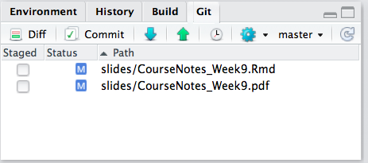
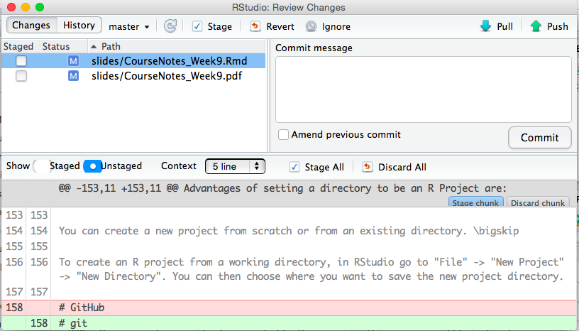
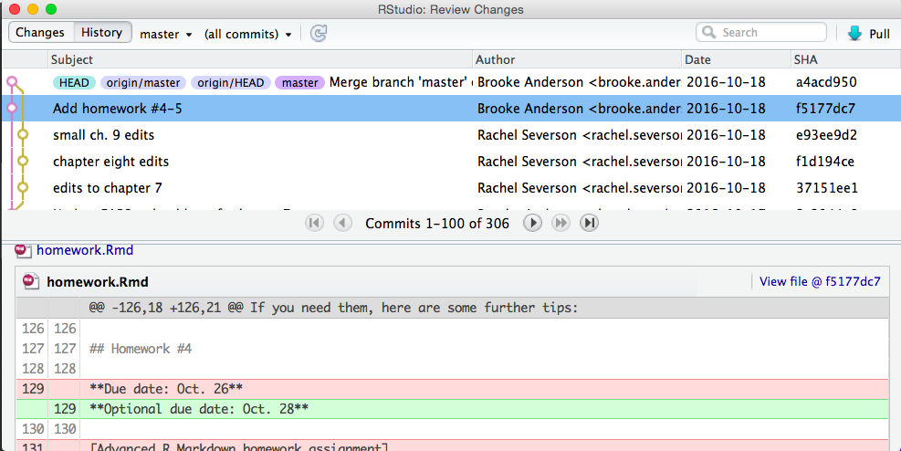

```{r setup, include=FALSE}
knitr::opts_chunk$set(echo = TRUE)
```

******
#	Open Source

##	Les licences
Vous pouvez **spécifier la licence de votre package dans le fichier DESCRIPTION** du package. 

Le type de licence de votre package R est important car **il fournit un ensemble de contraintes sur la manière dont les autres développeurs R vont pouvoir utiliser votre code**. 

Si vous écrivez un package R à utiliser en interne dans votre société, celle-ci peut choisir de ne pas partager le package. Dans ce cas, octroyer une licence à votre package R est moins important car celui-ci appartient à votre société et n'est distribué qu'en interne. 

***

Dans le fichier DESCRIPTION, vous pouvez spécifier l'existence d'un fichier LICENSE, puis créer un fichier texte appelé LICENSE qui explique que votre société se réserve tous les droits sur le package.

Toutefois, si vous (ou votre entreprise) souhaitez partager publiquement votre package R, vous devez envisager l'octroi de licences open source. La philosophie de **l'open source s'articule autour de trois principes:**

*  Le code source du logiciel **peut être inspecté.**
*  Le code source du logiciel **peut être modifié.**
*  Les versions modifiées du logiciel **peuvent être redistribuées**.

***

Les licences open source offrent les protections ci-dessus. Parmi les licences open source, **3 sont plus populaires**:  

*  **GPL**: General Public License (ou Licence publique générale GNU)
    > C'est une licence de logiciel libre et open source, **copyleft**, permettant donc d'inclure des modifications qu'à la condition qu'elles soient sous licence GPL.   
*  **MIT**: Massachusetts Institute of Technology
    > C'est une licence de logiciel libre et open source, **non copyleft**, permettant donc d'inclure des modifications sous d'autres licences, y compris non libres. 
    
*  **CCO**: Creative Commons
    > Les licences Creative Commons sont généralement utilisées pour des œuvres artistiques et créatives. C'est une licence **non copyleft** qui placera votre package dans le domaine public et qui n'obligera pas les utilisateurs à vous citer.
    
![Schéma de la réciprocité des logiciels libres issu de "Comprendre les licences de logiciels libres"[^9]](Images/Schema_OpenSource.PNG) 

***

##	Pourquoi l'open source

Vous avez mis des semaines à écrire un nouveau package R, alors pourquoi devriez-vous fournir une licence open source pour un logiciel que vous ou votre entreprise possédez par défaut? Pourquoi l’open source est une bonne idée?

***

*  **La communauté et la loi de Linus**  
Le développement de logiciels a commencé dans les milieux universitaires et les premiers programmes informatiques contenant du code pouvant être partagés et exécutés sur plusieurs ordinateurs étaient partagés entre les universitaires de la même manière que les universitaires partagent d'autres types de découvertes scientifiques. Le langage de programmation R est open source et il existe des centaines de packages R de haute qualité qui sont également open source. Un langage de programmation peut avoir beaucoup de fonctionnalités intéressantes mais **la croissance et l'amélioration continues d'un langage sont rendues possibles par les personnes qui contribuent au logiciel écrit dans ce langage**. 

***

**Pourquoi devriez-vous ouvrir le logiciel source?** 
Une des grandes raisons est un concept appelé **loi de Linus** qui fait référence à Linus Torvalds, le créateur de Linux. Le système d'exploitation Linux est un énorme projet de logiciel open source impliquant des milliers de personnes. Linux a une réputation de sécurité et de manque de bogues, ce qui est en partie dû au fait que tant de gens regardent et sont capables de modifier le code source. **Si les utilisateurs de votre logiciel sont en mesure de visualiser et de modifier le code source de votre package R, celui-ci sera probablement amélioré en raison de la loi de Linus.**

***

* **L'Open source est vecteur d'embauche**
    +   Si vous ouvrez votre logiciel open source et que d’autres personnes vous envoient des améliorations et des contributions, vous pouvez potentiellement identifier des candidats qui connaissent déjà votre code source. 
    +   si vous recherchez un emploi, vos contributions aux logiciels open source mettent en valeur vos compétences en logiciels.

***

#	Partage, contrôle de version et Github

**GitHub** vous permet de publier votre code en ligne dans des répertoires où tous les repertoires sont sous contrôle de version **git**. 

Vous pouvez publier des packages R sur GitHub et, avec la fonction install_github du package devtools, installer les packages R directement à partir de GitHub. 

GitHub peut être particulièrement utile pour collaborer avec d’autres sur les packages R, car il permet à tous les collaborateurs de transférer et de extraire du code entre leurs ordinateurs personnels et un répertoire GitHub. 

RStudio dispose de nombreuses fonctionnalités facilitant l’interface directe avec Git et GitHub.

***

Lorsque vous utilisez git et GitHub, 3 tâches sont essentielles:

**1.  Configuration initiale - Vous ne le ferez qu'une fois ** 
    *  Télécharger git
    *  Configurez git avec votre nom d'utilisateur et votre email
    *  Configurer un compte GitHub
    *  Configurez une clé SSH pour relier RStudio sur votre ordinateur personnel à votre compte GitHub

***

**2.  Configuration d’un repertoire spécifique:**   
    c’est ce que vous devez faire chaque fois que vous créez un nouveau repertoire, mais vous ne devez le faire qu’une fois par repertoire.  
    *  Initialiser le répertoire sur votre ordinateur personnel en tant que repertoire git
    *  Effectuer une validation initiale des fichiers dans le repertoire
    *  Créer un repertoire GitHub vide
    *  Ajouter le repertoire GitHub en tant que branche distante du repertoire local
    *  Poussez le repertoire local vers la branche distante GitHub (Si vous partez d'un repertoire GitHub plutôt que d'un repertoire local, clonez le repertoire ou branchez-le et clonez-le à la place.)  
    
***

**3.  Le flux de travail quotidien sur un repertoire - vous ferez cela régulièrement lors du développement du code dans un repertoire.**  
    *  Valider les modifications dans les fichiers du repertoire pour enregistrer l'historique git localement: **commit**  
    *  Transmettre les modifications validées à la branche distante de GitHub: **push**  
    *  Extrayez la dernière version de la branche distante GitHub pour intégrer les modifications apportées par les collaborateurs au code de repertoire enregistré sur votre ordinateur: **pull**  
    *  Écrire et résoudre des «problèmes» avec le code dans le repertoire: **issue**  
    *  Résoudre les conflits de fusion qui surviennent entre les modifications de code effectuées par différents collaborateurs  

Le guide "Happy Git and GitHub for the useR"[^10] de Jenny Bryan est un excellent support dans la compréhension de l'utilisation de Git et Github sur R.

***

##	Git

Git est un système de contrôle de version. Lorsqu'un repertoire est sous contrôle de version git, les informations sur toutes les modifications apportées, enregistrées et validées sur tout fichier non ignoré d'un repertoire sont enregistrées. Cela vous permet de revenir aux versions précédentes du repertoire et de rechercher dans l'historique toutes les validations effectuées sur les fichiers suivis du repertoire. Si vous travaillez avec d'autres personnes, l'utilisation du contrôle de version git vous permet de voir toutes les modifications apportées au code, qui l'a fait et pourquoi (via les commits: messages de validation).

Vous aurez besoin de git sur votre ordinateur pour créer des repertoires git locaux que vous pouvez synchroniser avec les repertoires GitHub. Comme R, git est open source. Vous pouvez le [télécharger](https://git-scm.com/downloads) pour différents systèmes d'exploitation.

Après avoir téléchargé git mais avant de l’utiliser, vous devez le configurer. Par exemple, vous devez vous assurer que votre nom et votre adresse électronique sont indiqués. Vous pouvez configurer git à partir d'un shell bash (pour les Mac, vous pouvez utiliser «Terminal», tandis que pour les PC, vous pouvez utiliser GitBash, fourni avec l'installation de git).

Selon le système d'exploitation, l'installation diffère. Le mieux est de suivre le guide "Happy Git and GitHub for the useR"[^10].

Vous pouvez utiliser les fonctions de configuration de git pour configurer votre version de git. Deux modifications à apporter consistent à inclure votre nom et votre adresse électronique sous les noms user.name et user.email. Par exemple, le code suivant, s’il est exécuté dans un shell bash, configure un compte git pour un utilisateur nommé «Jane Doe» possédant une adresse électronique générique:

```
git config --global user.name "Jane Doe"
git config --global user.email "jane.doe@university.edu"
```

Une fois que vous avez installé git, vous devez redémarrer RStudio afin que RStudio puisse identifier que git est maintenant disponible. Souvent, le simple redémarrage de RStudio suffira. Cependant, dans certains cas, vous devrez peut-être prendre des mesures supplémentaires pour activer git dans RStudio. Pour ce faire, allez dans «RStudio» -> «Préférences» -> «Git / SVN». Choisissez «Activer le contrôle de version». Si RStudio ne trouve pas automatiquement votre version de git dans la case «Git exécutable» (vous le saurez si cette case est vide), recherchez le fichier exécutable git à l’aide du bouton «Parcourir» situé à côté de cette case. Si vous n’êtes pas sûr de l’emplacement de votre exécutable git, essayez d’ouvrir un shell bash et d’exécuter quel git, ce qui devrait vous donner le chemin du fichier si vous avez installé git.

***

### Initialiser un répertoire git

Vous pouvez initialiser un repertoire git en utilisant les commandes d'un shell bash ou directement depuis RStudio. 

1.  A partir d'un shell bash:

*  Utilisez un shell («Terminal» sur les Mac) pour accéder à ce répertoire. Vous pouvez utiliser cd pour le faire (similaire à setwd dans R).  
*  Une fois que vous êtes dans le répertoire, vérifiez d'abord qu'il ne s'agit pas déjà d'un repertoire git. Pour ce faire, lancez git status. Si vous obtenez le message fatal: pas un repertoire git (ni aucun des répertoires parent): .git, ce n'est pas encore un repertoire git. Si vous ne recevez pas d'erreur de la part de git status, le répertoire est déjà un repertoire, vous n'avez donc pas besoin de l'initialiser.
*  Si le répertoire n'est pas déjà un repertoire git, exécutez git init pour l'initialiser en tant que repertoire.

Par exemple, si je voulais créer un répertoire appelé «exemple_analyse», qui est un sous-répertoire direct de mon répertoire personnel, un repertoire git, je pourrais ouvrir un shell et exécuter:

```
cd ~/exemple_analyse
git init
```

2. A partir de R Studio.

*  Faites du répertoire un projet R. Si le répertoire est un package R, il contient probablement déjà un fichier .Rproj et il en va de même pour un projet R. Si le répertoire n'est pas un projet R, vous pouvez en créer un à partir de RStudio en allant dans «File» -> «New project» -> «Existing directory», puis accédez au répertoire dans lequel vous souhaitez créer un projet R.  
    +  Ouvrez le projet R.
    +  Allez dans «Tools» -> «Version control» -> «Project setup».  
    +  Dans la zone «Version control system», choisissez «Git».  

Si vous ne voyez pas «Git» dans la zone «Système de contrôle de version», cela signifie soit que Git n'est pas installé sur votre ordinateur, soit que RStudio n'a pas réussi à le trouver. Si tel est le cas, consultez les instructions précédentes pour vous assurer que RStudio a identifié l'exécutable de git.

Une fois que vous avez initialisé le projet en tant que repertoire git, vous devez avoir une fenêtre «Git» dans l’un de vos volets RStudio (volet supérieur droit par défaut). Lorsque vous apportez et sauvegardez des modifications dans des fichiers, elles apparaîtront dans cette fenêtre pour que vous puissiez les valider.  



***

### Commit

Lorsque vous voulez que git enregistre les modifications, vous réalisez un **commit** ("engager la modification") permettant de prendre en compte les fichiers avec les modifications. Chaque fois que vous validez, vous devez inclure un court message de validation contenant des informations sur les modifications. Vous pouvez faire des commits depuis un shell. Cependant, le flux de travail le plus simple pour un projet R, y compris les packages R, consiste à effectuer des commits git directement à partir de l'environnement RStudio.

Pour effectuer une validation de RStudio, cliquez sur le bouton «Valider» dans la fenêtre Git. 



Dans cette fenêtre, pour valider les modifications:  

1.  Cliquez sur les cases correspondant aux noms de fichiers dans le panneau en haut à gauche pour sélectionner les fichiers à valider.  
2.  Si vous le souhaitez, vous pouvez utiliser la partie inférieure de la fenêtre pour examiner les modifications que vous avez effectuées dans chaque fichier.  
3.  Écrivez un message dans la case «Valider le message» dans le panneau supérieur droit. Gardez le message sur une ligne dans cette case si vous le pouvez. Si vous devez en expliquer davantage, écrivez un court message d'une ligne, sautez une ligne, puis rédigez une explication plus longue.  
4.  Cliquez sur le bouton «Commit» à droite.

Une fois que vous avez validé les modifications apportées aux fichiers, ceux-ci disparaissent de la fenêtre Git jusqu'à ce que vous apportiez et sauvegardiez davantage de modifications.

***

### Naviguer dans l'historique

En haut à gauche de la fenêtre de validation, vous pouvez basculer sur «History». Cette fenêtre vous permet d’explorer l’historique des validations pour le repertoire. 



***

##	Github

### Cloner/Lier un répertoire local à Github

GitHub vous permet d’héberger des dépôts git en ligne. Cela vous permet de:

*  Travailler en collaboration sur un repertoire partagé  
*  Créez à partir du repertoire de quelqu'un d'autre votre propre copie que vous pourrez utiliser et modifier à votre guise  
*  Proposer des modifications aux repertoires d’autres personnes par le biais de demandes de tirage  

Pour ce faire, vous aurez besoin d’un compte GitHub. Vous pouvez vous inscrire sur [](https://github.com). Sur un compte gratuit, tous vos repertoires sont «publics» (visibles par tous).

Vous devez modifier certains paramètres dans RStudio afin que GitHub reconnaisse qu'il est possible de faire confiance à votre ordinateur, plutôt que de vous demander votre mot de passe à chaque fois. Pour ce faire, ajoutez une clé SSH de RStudio à votre compte GitHub en procédant comme suit:

1.  Dans RStudio, allez dans «RStudio» ->“Preferences” -> “Git / svn”. Choisissez “Create RSA key”.  
2.  Cliquez sur “View public key”. Copiez tout ce qui apparaît.  
3.  Accédez à votre compte GitHub et accédez à «Settings». Cliquez sur «SSH and GPG keys».  
4.  Cliquez sur «New SSH key». Nommez la clé quelque chose comme «Ordi Arnaud». Collez votre clé publique dans la «Key box».  

***

### 3 façons de connecter un répertoire à Github:

*  **Nouveau projet, Github en premier**  
*  **Projet existant, GitHub en premier**   
*  **Projet existant, GitHub en dernier**  

***

#### Nouveau projet, Github en premier

1.  Faire un repo sur GitHub  

    > Faites cela une fois par nouveau projet .

    >Aller à https://github.com et assurez-vous que vous êtes connecté.

    >Cliquez sur le bouton vert «New repository» . 
      *  Nom du répertoire : myrepo (ou ce que vous voulez)
      *  Public
      *  OUI initialisez ce répertoire avec un fichier README

    >Cliquez sur le gros bouton vert « Créer un répertoire».

    >Copiez l’URL de clone HTTPS dans votre presse-papiers via le bouton vert «Clone or download» . Ou copiez l'URL SSH si vous avez choisi de configurer des clés SSH.

2. Nouveau projet RStudio via git clone

Dans RStudio , démarrez un nouveau projet:

    >File > New Project > Version Control > Git . Dans «repository URL», collez l'URL de votre nouveau répertoire GitHub. Ça va être quelque chose comme ça https://github.com/arnaudmilet/myrepo.git .  
    >Bien choisir et se rappeler le chemin vers le projet.
    >Cliquez sur «Create Project» pour créer un nouveau répertoire, qui sera:  
        *  un répertoire ou "dossier" sur votre ordinateur  
        *  un répertoire Git, lié à un référentiel GitHub distant  
        *  un Projet RStudio   

3.  Apporter des modifications locales, enregistrer, commit

Faire ceci chaque fois que vous terminez un précieux morceau de travail , probablement plusieurs fois par jour .

De RStudio , modifiez le fichier README.md , par exemple, en ajoutant la ligne "Ceci est une ligne de RStudio”. Enregistrez vos modifications.

Validez ces modifications dans votre référentiel local:  

    >Cliquez sur l'onglet "Git" dans le volet supérieur droit.  
    >Cochez la case " Staged " pour tous les fichiers que vous voulez commiter.  
    >Tapez un message dans «Commit message», tel que «Commit from RStudio”.
    >Cliquez sur "Commit" 

4.  Poussez vos modifications locales vers GitHub (**Push**)

Faites cela quelques fois par jour.

Avant de faire un push, il est préférable de tirer depuis github (pull).Ca permet de prendre en compte les modifications faites par d'autres utilisateurs. 


5.  Confirmer le changement local

Regardez dans répertoire Github si les changement ont été pris en compte.

***

### Projet existant, GitHub en premier

Il s'agit ici de faire la même chose que précedemment puis de copier/coller un projet existant dans le nouveau projet et de le pousser vers Github.

***

### Projet existant, GitHub en dernier

1.  Vous avez un projet
2.  Faites en un repertoire Git, 3 possibiltés:
    *  usethis::use_git()
    *  Dans RStudio : Tools > Project Options … > Git/SVN. Dans “Version control system”, sélectionnez “Git”. Confirm New Git Repository? Yes!
    *  Dans un shell, dans le repertoire du projet faites un **git init**
3.  Continuez votre travail (modification, validation, commit,..)
4.  Connectez votre répertoire à Github avec usethis::use_github()

***

### Traitement des problèmes/bugs/modifications listés

Chaque répertoire GitHub original (c’est-à-dire qu’il ne s’agit pas d’une branche d’un autre répertoire) a un onglet intitulé «Issues». Cette page fonctionne comme un forum de discussion. Vous pouvez créer de nouveaux fils «Issue» pour décrire et discuter des choses que vous souhaitez modifier sur le répertoire.

Les problèmes peuvent être fermés une fois le problème résolu. Vous pouvez fermer les problèmes sur la page «Issues» avec le bouton «Close Issue». Si un commit que vous faites dans RStudio ferme un problème, vous pouvez le fermer automatiquement sur GitHub en incluant «Close # [numéro du problème]» dans votre message de commit, puis en le transmettant à GitHub. Par exemple, si le problème n°5 est «Corrigez une faute de frappe dans la section 3» et que vous apportez une modification pour corriger cette faute de frappe, vous pouvez créer et enregistrer la modification localement, puis prendre en compte cette modification avec le message de validation «Close #5», puis **push** (Pousser...) vers GitHub, et le problème n°5 dans "Issues" sera automatiquement fermé, avec un lien vers la validation qui corrigera le problème.

***

### Proposer des modifications sur le répertoire d'un autre utilsateur: "pull request"

Vous pouvez suggérer des modifications à un répertoire que vous ne possédez pas ou pour lequel vous n'avez pas l'autorisation de modifier directement. Procédez comme suit pour suggérer des modifications au répertoire de quelqu'un d’autre:


**1.  Forker le projet:**
Un fork est une copie d’un dépôt. Forker un dépôt vous permet d’expérimenter librement des modifications sans toucher au projet original.   


**2.  Créer une branche et travailler dessus**  


**3.  Publier la branche sur son fork**  
**4.  Créer la pull-request**  

![[^11]](Images/fork-triangle-happy.png)

*  **Un dépôt de référence, conventionnellement appelé *upstream* **  
    C’est le dépôt du projet auquel nous voulons contribuer.  
    Nous n’avons que les droits en lecture dessus.  
*  **Un dépôt de fork, conventionnellement référencé *origin* **  
    C’est une copie du dépôt de référence.  
    Nous avons tous les droits dessus.  
*  **Un dépôt local**  
    C’est notre dépôt de travail.  

***

### Gestion des conflits

À un moment donné, si vous utilisez GitHub pour collaborer sur du code, vous obtiendrez des conflits. Cela se produit lorsque deux personnes ont modifié le même code de deux manières différentes en même temps.

Par exemple, supposons que deux personnes travaillent sur des versions locales du même répertoire et que la première personne modifie une ligne en mtcars [1,], tandis que la deuxième personne modifie la même ligne en tête (mtcars, 1). La deuxième personne insère ses commits dans la version GitHub du répertoire avant la première personne. Désormais, lorsque la première personne extraira les derniers commits dans le répertoire GitHub, il y aura un conflit pour cette ligne. Pour pouvoir statuer sur une version finale, la première personne devra décider quelle version du code utiliser et valider une version du fichier avec ce code.

S'il y a des conflits de fusion, ils apparaîtront comme ceci dans le fichier:

```{r, eval=F}
<<<<<<< HEAD
mtcars[1, ]
=======
head(mtcars, 1)
>>>>>>> remote-branch
```

Pour les résoudre, recherchez tous ces endroits dans les fichiers en conflit, choisissez le code que vous souhaitez utiliser et supprimez tout le reste. Pour l'exemple de conflit, il pourrait être résolu en modifiant le fichier comme ceci:

```{r,eval=F}
head(mtcars, 1)
```

Ce conflit est maintenant résolu. Une fois que vous avez résolu tous les conflits dans tous les fichiers du répertoire, vous pouvez enregistrer et valider les fichiers.

Ces conflits peuvent survenir dans quelques situations:

*  Vous recevez les commits de la branche GitHub du répertoire sur lequel vous avez travaillé localement.  
*  Quelqu'un fait une pull request pour l'un de vos répertoires et vous avez mis à jour une partie du code entre le moment où la personne a créé le répertoire et soumis la pull request.

***

##	Exercice: Déposer les packages monpackage et fars sur github

***

#	Philosophie et design du package
##	Philosophie Unix

Le langage de programmation R est un logiciel open source et de nombreux packages logiciels open source s’inspirent de la conception du système d’exploitation Unix sur lequel sont basés macOS et Linux. Ken Thompson - l'un des concepteurs d'Unix - a d'abord exposé cette philosophie, et de nombreux principes de philosophie Unix peuvent être appliqués aux programmes R. Le thème philosophique général des programmes Unix est de bien faire une chose. S'en tenir à cette règle remplit plusieurs objectifs:

*  Étant donné que votre programme ne **fait qu'une chose**, les chances que votre programme contienne plusieurs lignes de code sont réduites. Cela signifie que les autres peuvent plus facilement lire le code de votre programme afin qu’ils puissent comprendre exactement comment cela fonctionne (s’ils ont besoin de savoir).  
*  La simplicité de votre programme réduit les risques de problèmes majeurs, car **moins de lignes de code** signifient moins de risque de commettre une erreur: **lapply, purr: utiliser la vectorisation**  
*  Votre programme sera plus facile à comprendre pour les utilisateurs si les inputs et outputs sont réduits: **Une fonction ne fait qu’une chose.**    
*  Les programmes construits avec d'autres petits programmes ont plus de chance d'être également petits. Cette possibilité de **chaîner plusieurs petits programmes** pour en faire un programme plus complexe (mais également petit) est appelée "composabilité": Avec le package **magrittr**, les pipes en R sont facilités.   

***

##	Valeurs par défaut

Fournir un maximum de valeurs par défaut dans vos fonctions permet de limiter le risque d'inputs incorrects ou inattendus. Vous devez  que ce qui est raisonnable. 

***

##	Nommer les éléments

Nommer les fonctions et les variables pour que leur utilisation soit simple dans R:

*  Utilisez "_" et les minuscules. Les packages R modernes utilisent des noms de fonction et de variable comme geom_line (), bind_rows () et unnest_token (),...  
*  Utilisez des noms courts  
*  Les noms doivent être significatifs et descriptifs.  
*  Assurez-vous de ne pas attribuer des noms existants et communs dans R. Vous pouvez vérifier si un nom est pris à l'aide de la fonction apropos():  

```{r}
apropos("mean")
```

Vous pouvez envisager de regrouper des fonctions similaires dans des familles qui commencent toutes par le même préfixe court. Par exemple, dans le package ggplot2, la famille de fonctions aes_ définit l'esthétique des graphismes, la famille de fonctions gs_ interagit avec l'API Google Sheets du package googlesheets, la famille de fonctions geom_ initialise les graphiques, ...

***

##	Respecter la communauté d’utilisateurs

Si vous écrivez un package avec des fonctions utiles et bien conçues, vous aurez peut-être la chance que votre package devienne populaire! D'autres peuvent utiliser vos fonctions pour étendre ou adapter leurs fonctionnalités à d'autres fins. Cela signifie que lorsque vous établissez un ensemble d’arguments pour une fonction, vous promettez implicitement une certaine stabilité pour les inputs et les outputs de cette fonction. Changer l’ordre ou la nature des arguments de fonction ou des valeurs de retour peut casser le code d’autres personnes, ajouter du travail et causer du tort à ceux qui ont choisi d’utiliser votre logiciel.   
Si vous pensez que les fonctions d’un package que vous développez ne sont pas encore stables, vous devez en informer les utilisateurs afin qu’ils soient avertis s’ils décident de développer votre travail.

***

#	Intégration continue

Utilser des services d’intégration continue permet de réaliser des tests de vos packages pour des systèmes d'exploitation ne correspondant pas forcément au vôtre:   
*  **Travis**: Tester votre package sous Linux  
*  **AppVeyor**: Tester votre package sous Windows  

Ces deux services sont gratuits pour les packages R construits dans des répertoires GitHub. Ces services d'intégration continue seront exécutés chaque fois que vous réaliserez un push. Ces services s’intègrent parfaitement à GitHub afin que vous puissiez voir si votre package est construit correctement ou non.

***

##	Travis

Pour commencer à utiliser Travis, allez sur https://travis-ci.org et connectez-vous avec votre compte GitHub. En cliquant sur votre nom dans le coin supérieur droit du site, une liste de vos dépôts publics GitHub apparaîtra. 

Ouvrez votre console R et accédez à votre répertoire de packages R. Maintenant, chargez le package devtools avec la library(devtools) et entrez use_travis() dans votre console R. Cette commande va configurer un fichier .travis.yml de base pour votre package R. Vous pouvez maintenant ajouter, valider et appliquer vos modifications à GitHub, ce qui déclenchera la première construction de votre package sur Travis. Retournez à https://travis-ci.org pour voir votre package construit et testé en même temps! 

Une fois que votre package a été construit pour la première fois, vous pourrez obtenir un badge. Il s’agit d’une petite image générée par Travis qui indique si votre package est construit correctement et qu’il réussit tous vos tests. Vous pouvez afficher ce badge dans le fichier README.md du répertoire GitHub de votre package afin que vous et les autres utilisateurs puissiez contrôler l’état votre test sur Linux.

***

##	Appveyor

Vous pouvez commencer à utiliser AppVeyor en allant sur https://www.appveyor.com/ et en vous connectant avec votre compte GitHub. Une fois connecté, cliquez sur «Projects» dans la barre de navigation supérieure. Si vous avez des répertoires GitHub qui utilisent AppVeyor, vous pourrez les voir ici. Pour ajouter un nouveau projet, cliquez sur "Nouveau projet" et recherchez le répertoire GitHub correspondant au package R que vous souhaitez tester sous Windows. Cliquez sur «Add» pour qu'AppVeyor commence à suivre ce répertoire.

Ouvrez votre console R et accédez à votre répertoire de packages R. Maintenant, chargez le package devtools avec la library(devtools) et entrez use_appveyor() dans votre console R. Cette commande configurera un fichier appveyor.yml par défaut pour votre package R. Vous pouvez maintenant ajouter, valider et appliquer vos modifications à GitHub, ce qui déclenchera la première construction de votre package sur AppVeyor. 

Retournez à https://www.appveyor.com/ pour voir le résultat de la construction.

Comme Travis, AppVeyor génère également des badges que vous pouvez ajouter au fichier README.md du répertoire GitHub de votre package.

***

## Un mot sur les chemins d'accès

Les chemins d'accès aux fichiers et aux dossiers peuvent avoir de grandes différences entre les systèmes d'exploitation. En général, vous devriez éviter de créer un chemin "à la main". Par exemple, si je voulais accéder à un fichier appelé data.txt, il se trouverait sur le bureau de l'utilisateur à l'aide de la chaîne "~ / Desktop / data.txt". fonctionne si ce code a été exécuté sur une machine Windows. En général, vous devez toujours utiliser des fonctions pour créer et trouver des chemins d'accès aux fichiers et aux dossiers. La méthode de programmation correcte pour construire le chemin ci-dessus consiste à utiliser la fonction file.path(). Donc, pour obtenir le fichier ci-dessus, je voudrais faire ce qui suit:

```{r}
file.path("~", "Desktop", "data.txt")

```


En général, il n’est pas garanti sur un système que le fichier ou le dossier que vous recherchez existera. Toutefois, si l’utilisateur de votre package a installé votre package, vous pouvez être sûr que tous les fichiers de votre package existent sur leur ordinateur. Vous pouvez trouver le chemin des fichiers inclus dans votre package en utilisant la fonction system.file(). Tous les fichiers ou dossiers du répertoire inst/ de votre package seront copiés à partir du niveau suivant, une fois votre package installé. Si votre package s'appelle ggplyr2 et qu'il y a un fichier sous inst/data/first.txt, vous pouvez obtenir le chemin de ce fichier avec system.file("data", "first.txt", package = "ggplyr2"). 

